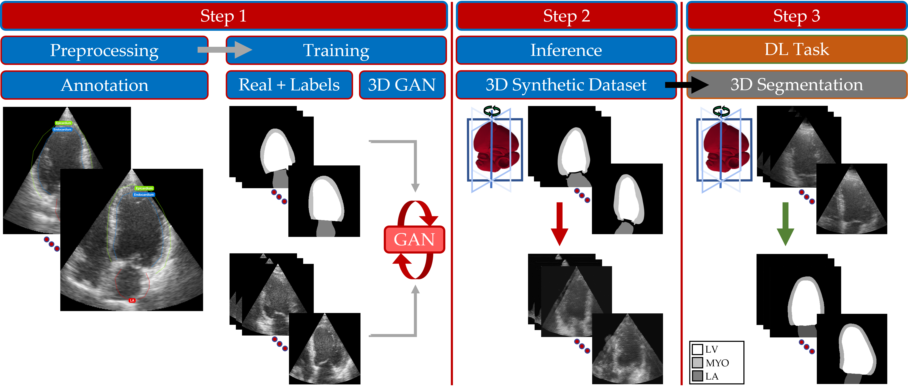

# Generate Synthetic Labeled Datasets of 3D Echocardiography Images Using a 3D Paired GAN

Repository for code from the paper "A Data Augmentation Pipeline to Generate Synthetic Labeled Datasets of 3D Echocardiography Images Using a GAN", available [here](https://ieeexplore.ieee.org/abstract/document/9893790).


## Overview

This repository contains the scripts to train a 3D GAN, in order to generate 3D echocardiography images. 

The generative model relies on a 3D version of the original [pix2pix](https://github.com/phillipi/pix2pix) model, using a 3D U-Net.

At inference time, the input is an anatomical mask of different cardiac structures and the output is the corresponding synthetic 3D echocardiography image.

For the 3D segmentation task, please see the original [nnU-Net](https://github.com/MIC-DKFZ/nnUNet) repository.




## Dataset
You will have to align your paired dataset in the following way:

```
input_path/dataroot/
  ├── trainA/
    ├── image1.png
    ├── image2.png
    ├── ...
  ├── trainB/
    ├── mask1.png
    ├── mask2.png
    ├── ...
  ├── testA/
    ├── test_image1.png
  ├── testB/
    ├── test_mask1.png
```


## Training

```
pyhton train.py --dataroot (path to your dataroot folder) --batchSize 2 --depthSize 32 --input_nc 1 --output_nc 1 --which_model_netG unet_256 --which_model_netD n_layers --name (experiment name) --dataset_mode nodule --model pix2pix3d --nThreads 4 --no_flip --loadSize 256 --fineSize 256 --niter 100 --niter_decay 100 --pool_size 50 --norm batch --which_direction AtoB
```


## Inference

```
pyhton test.py --dataroot (path to your dataroot folder)  --results_dir (path where to save the generated images) --ntest 1 --how_many 1 --batchSize 1 --depthSize 32 --input_nc 1 --output_nc 1 --which_model_netG unet_256 --which_model_netD n_layers --name (experiment name) --dataset_mode single --model test --nThreads 4 --no_flip --loadSize 256 --fineSize 256 --norm batch --which_direction AtoB --which_epoch 50
```
